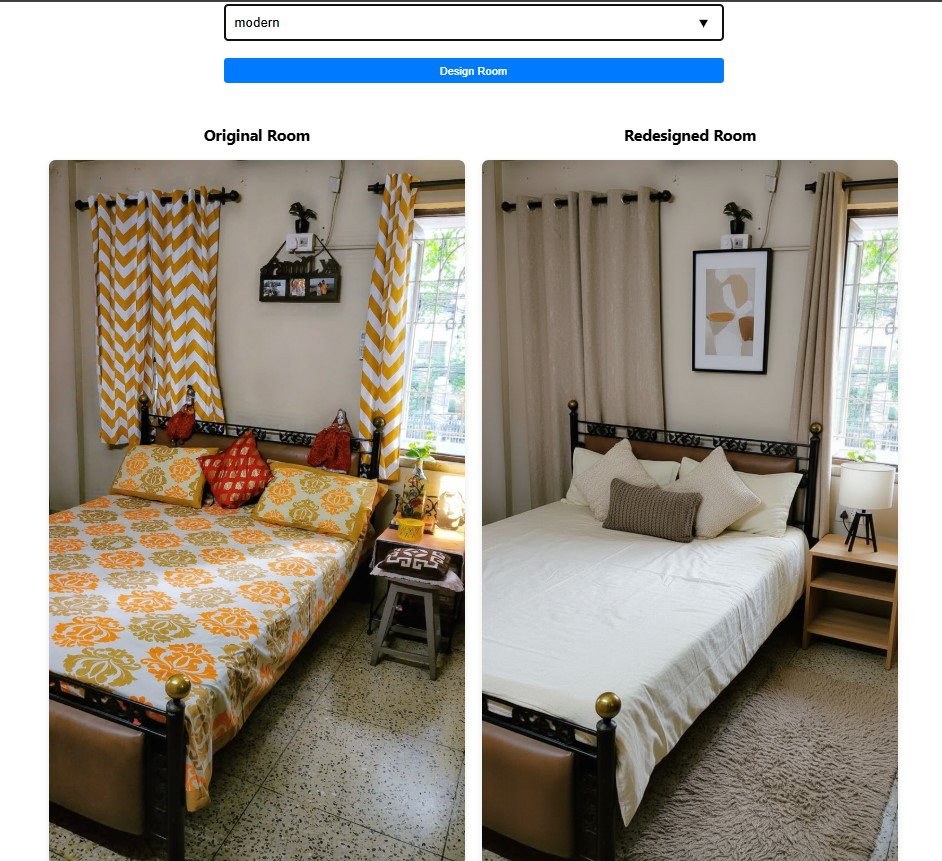
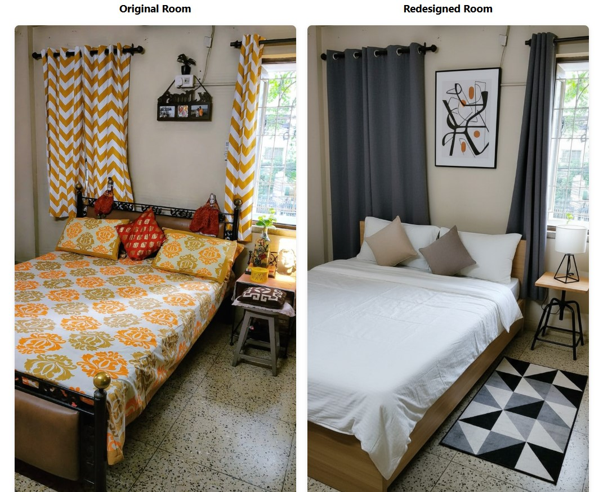
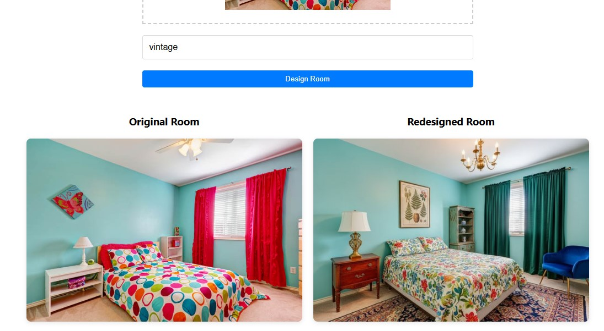

# 🛋️ Room Redesign Assistant  
**An AI-powered tool to visualize and shop your dream room.**

## 🚀 Overview  
Room Redesign Assistant is a full-stack AI application that simplifies interior design by helping users **visualize a redesigned version of their room** and directly **purchase suggested items from Amazon**.

## 🛠️ How It Works  
1. **Upload Your Room Image**  
   Users begin by uploading a photo of their existing room.

2. **Choose a Design Theme**  
   Options include styles like *modern*, *vintage*, *relaxed*, and more.

3. **AI-Powered Redesign**  
   Using Google Gemini's image generation model, the app:
   - Identifies the existing layout.
   - Suggests decor and furniture tailored to the chosen theme.
   - Generates a new image showing the transformed room.

4. **View Final Product in Your Room**  
   Users can see what the suggested redesign would look like in their actual room environment — creating a realistic visual before making any changes.

5. **Shop the Look**  
   The app fetches real product listings from Amazon, allowing users to:
   - View item details and pricing.
   - Click through and purchase directly from Amazon.

## 💡 Key Features  
- ✨ AI-generated room redesigns based on user preferences  
- 🖼️ Realistic image previews of the redesigned space  
- 🛍️ One-click access to purchase suggested items via Amazon  
- 🧠 Powered by Google Gemini for advanced image generation and reasoning

## 🌟 Why It Stands Out  
Room Redesign Assistant bridges the gap between *imagination* and *execution*, combining AI creativity with real-world shopping. Whether you're planning a makeover or just browsing ideas, it turns inspiration into action in a few simple steps.


## Prerequisites

- Python 3.7 or higher
- Node.js 16.x or higher (recommended 16.x LTS)
  - To check your Node.js version: `node --version`
  - Download Node.js from: https://nodejs.org/
- Set the environment variable `GEMINI_API_KEY` with your Google Gemini API key.
  - Instructions for obtaining the API key can be found at: https://ai.google.dev/gemini-api/docs/api-key

## Setup and Running

### Backend Setup

1. Navigate to the backend directory and create virtual environment:
```bash
cd backend
python -m venv venv
```

2. Activate the virtual environment:
   - On Windows:
```bash
venv\Scripts\activate
```
   - On Unix or MacOS:
```bash
source venv/bin/activate
```

3. Install required packages (make sure your virtual environment is activated, you should see (venv) in your terminal):
```bash
pip install -r requirements.txt
```
If you get any errors, try:
```bash
pip install --upgrade pip
pip install -r requirements.txt
```

4. Set the `GEMINI_API_KEY` environment variable:
   - On Windows:
```bash
set GEMINI_API_KEY=your_api_key_here
```
   - On Unix or MacOS:
```bash
export GEMINI_API_KEY=your_api_key_here
```

5. Run the backend server:
```bash
python main.py
```
The backend will run on http://localhost:8000

### Frontend Setup

1. Install dependencies:
```bash
cd frontend
npm install
```

2. Run the frontend development server:
```bash
npm start
```
The frontend will run on http://localhost:3000

## Usage

1. Open http://localhost:3000 in your browser.
2. Upload an image of your room.
3. Optionally, enter a theme (e.g., relaxed, vintage, calm, modern, gadget freak).
4. Click Submit to see the redesigned room image alongside the original.
5. View the list of suggested items with their details and clickable Amazon links.

## Results

### Theme: Modern  


### Theme: Calm  


### Theme: Vintage  


